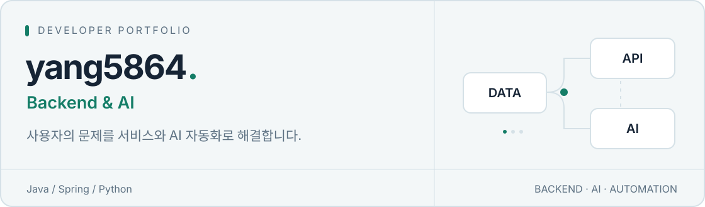

<picture>
  <source media="(prefers-color-scheme: dark)" srcset="./assets/banner-dark.svg">
  
</picture>

  <a href="#about">About</a> ·
  <a href="#selected-work">Selected Work</a> ·
  <a href="#tech-stack">Tech Stack</a> ·
  <a href="#engineering-notes">Engineering Notes</a>

## About

**데이터를 연결하고, 사용자가 쓸 수 있는 서비스로 완성합니다.**

Java·Spring 기반 백엔드를 중심으로 금융 데이터 연동, AI 기능, 반복 업무 자동화를 개발하고 있습니다. 모델의 결과를 API와 화면에 연결하고, 데이터가 저장되고 전달되는 흐름까지 함께 고민합니다.

## Selected Work

### 01 / Jaedaero

**제대로 — 군 특화 AI 자산관리 서비스**

군 복무 중의 소득과 금융 데이터를 바탕으로 전역 예상 자산과 자산관리 전략을 제공하는 팀 프로젝트입니다. 백엔드와 AI 기능 개발에 참여했습니다.

- 규칙으로 분류하기 어려운 거래를 AI로 보완하는 거래 카테고리 분류를 구현했습니다.
- Redis Streams와 FCM을 연결한 알림 시스템을 구현하고, 알림 시간대를 한국 시간으로 통일했습니다.

`Java` `Spring MVC` `MyBatis` `MySQL` `Redis` `FCM`

[프로젝트 소개](https://github.com/BellongBellong) · [백엔드 코드](https://github.com/BellongBellong/Jaedaero_backend) · [프론트엔드 코드](https://github.com/BellongBellong/Jaedaero_frontend)

### 02 / BitOracle

**BitOracle — 가상자산 시계열 분석과 예측 API**

비트코인 시장 데이터를 분석하고, GRU 모델의 예측 결과를 서비스에 연결하는 팀 프로젝트입니다. 모델 실험과 AI 서버 개발을 진행했습니다.

- 가격과 기술적 지표를 전처리해 시계열 모델의 입력으로 구성하고, 여러 모델 구조와 피처를 실험했습니다.
- FastAPI로 예측 결과를 제공하는 추론 서버를 구현했습니다.

`Python` `FastAPI` `TensorFlow` `Keras` `Pandas` `NumPy`

[AI 서버 코드](https://github.com/BitOracle-bitoracle/bitoracle-ai-server) · [프론트엔드 코드](https://github.com/BitOracle-bitoracle/bitoracle-frontend) · [초기 모델 실험](https://github.com/yang5864/Cryptocurrency-Prediction-Model)

### 03 / Ya-Geum

**야금 — 소비 기록과 절약 챌린지를 연결한 모바일 웹 앱**

가계부와 절약 챌린지를 함께 제공하는 팀 프로젝트입니다. 팀장으로 참여해 거래 화면, API와 챌린지 데이터 구조를 설계했습니다.

- 거래 내역 메인 화면과 거래 추가 바텀시트를 구현했습니다.
- json-server API를 Railway에 배포하고, 재배포 후에도 데이터가 유지되도록 Volume을 연결했습니다.

`Vue 3` `JavaScript` `Pinia` `json-server` `Railway`

[프론트엔드 코드](https://github.com/yang5864/Ya-Geum) · [백엔드 코드](https://github.com/yang5864/yageum-backend)

### 04 / Tetz Bot

**Slack 봇 — 알고리즘 스터디 운영 자동화**

매일 반복되는 스터디 인증 안내와 제출 확인을 자동화한 개인 프로젝트입니다.

- Slack API로 인증 스레드를 만들고, 제출 현황과 마감 결과를 자동으로 안내합니다.
- GitHub Actions와 외부 스케줄러를 연결하고, 재실행 시 누적 기록이 중복으로 갱신되지 않도록 처리했습니다.

`Python` `Slack API` `GitHub Actions`

[코드와 운영 구조](https://github.com/yang5864/Slack-msg)

## Tech Stack

프로젝트에서 사용한 기술을 중심으로 정리했습니다.

| Area | Technologies | Experience |
| :--- | :--- | :--- |
| Backend | Java · Spring MVC · MyBatis · MySQL · Redis | 금융 서비스 API와 비동기 알림 |
| AI & Data | Python · FastAPI · TensorFlow · Keras · Pandas · NumPy | 시계열 모델 실험과 추론 API |
| Frontend | JavaScript · Vue 3 · Pinia | 거래 내역 화면과 입력 흐름 |
| Delivery | GitHub Actions · Railway · Slack API | 배포와 반복 운영 업무 자동화 |

## Engineering Notes

코드와 문서에서 확인할 수 있는 구현 기록입니다.

- **AI와 규칙의 역할을 나누기** — 거래 분류에 규칙과 AI를 함께 사용한 [구현 커밋](https://github.com/BellongBellong/Jaedaero_backend/commit/5fde1cf27ce37de09e0a42fd710927fa499d10c5)
- **알림을 전달하는 흐름 만들기** — Redis Streams와 FCM을 연결한 [구현 커밋](https://github.com/BellongBellong/Jaedaero_backend/commit/ce3daf7054f913e986b8094e2dfa9b078aa6de23)
- **재배포 후 데이터 유지하기** — 컨테이너와 저장소의 수명을 구분한 [배포 문서](https://github.com/yang5864/yageum-backend#readme)
- **반복 실행을 고려하기** — 중복 갱신 방지와 스케줄 실행을 정리한 [봇 운영 문서](https://github.com/yang5864/Slack-msg#readme)

---

프로젝트의 구체적인 구현과 실행 방법은 각 저장소에서 확인할 수 있습니다.

