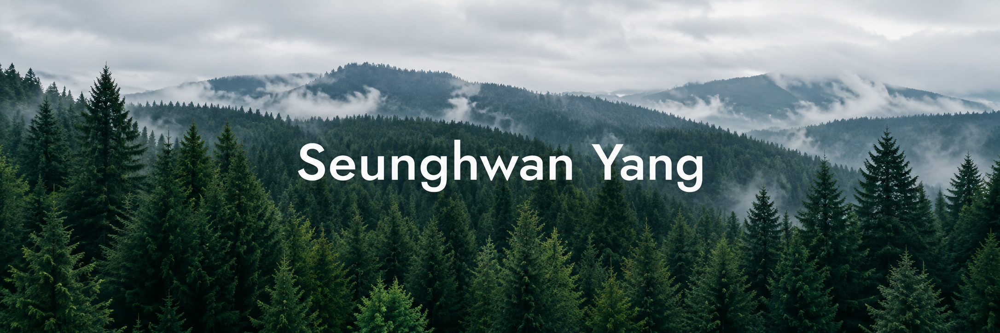

  

### About Me

사용자의 문제를 서비스와 AI 자동화로 해결하는 백엔드 개발자입니다. 직접 만들고 운영하며, 배운 것을 기록합니다.

### Tech Stack

    
    
   

### Follow Me

  
  
  

### GitHub Stats

<picture>
  <source media="(prefers-color-scheme: dark)" srcset="./profile/stats-dark-en.svg">
  
</picture>

 

## 💼 Experience

- [KB IT's Your Life 7기 기자단](https://blog.naver.com/shy_fr00), 금융·IT 콘텐츠 작성 · 24주 기록 (2026.03–2026.08)
- **Tetz 알고리즘 스터디**, 스터디장 · 인증·공지 운영 자동화 (2026.03~)
- **모두의 창업 프로젝트 1기**, Pacto 창업 아이디어 구체화 · 도전 참여 (2026.05)

## 💻 Projects

- [제대로](https://github.com/BellongBellong/Jaedaero_backend), 백엔드·AI 개발 · 6인 팀 (2026.07–2026.08)
- [Pacto](https://github.com/Pacto-Developers/Pacto-backend), 팀장·백엔드 개발 · 4인 팀 (2026.04~)
- [BlogLife](./PORTFOLIO.md#03--bloglife), 블로그 자동화 앱 · 개인 기획·개발·운영 (2025.12~)
- [YOJ](./PORTFOLIO.md#04--yoj), 스터디용 온라인 저지 · 개인 기획·개발·운영 (2026.04~)
- [BitOracle](https://github.com/BitOracle-bitoracle/bitoracle-ai-server), 시계열 AI 모델·추론 API 개발 (2024.09–2025.06)
- [Ya-Geum](https://github.com/yang5864/Ya-Geum), 팀장·거래 화면·API 설계 · 5인 팀 (2026.04–2026.05)
- [Tetz Bot](https://github.com/yang5864/Slack-msg), 스터디 운영 봇 · 개인 개발 (2026.03~)
- [어부바](./PORTFOLIO.md#more-projects), 시니어 금융지원 서비스 기획·프로토타입 · 5인 팀 (2026.09)

## 🛠️ Skills

- **Language** — Java, Python, TypeScript
- **Backend** — Spring MVC, Spring Boot, FastAPI, MyBatis, JPA
- **Data** — MySQL, PostgreSQL, Redis, Supabase
- **AI / Automation** — TensorFlow·GRU, LLM API, Selenium·CDP
- **Frontend** — Vue 3·Pinia, Next.js
- **Infra / DevOps** — AWS EC2·ECR·SSM, Docker, GitHub Actions
- **Observability / Quality** — Prometheus, Grafana, k6, pytest

## 🎓 Education

- **숭실대학교**, 컴퓨터학부 학사
- **KB IT's Your Life 7기**, Java·Spring·DB·클라우드 교육 수료 (2026.03–2026.08)
- **KG IT Bank**, C·Java 과정 128시간 수료 (2023.01–2023.02)

## 🏆 Awards & Recognition

- **IBK기업은행 우수면접자 선정**, 금융권 공동채용박람회 (2026.09)
- **KB IT's Your Life 해커톤 장려상**, 팀 효도과자 · 어부바 (2026.09.10)
- **KB IT's Your Life 7기 최우수 기자상** (2026.08.27)
- **KB IT's Your Life 1단위기간 우수훈련생** (2026.04.07)
- **제23경비여단장 표창**, 이상 징후 식별·신속 보고 공로 (2022.06.12)

## 📜 Certifications

- **AWS Certified Cloud Practitioner** (2025.12)
- **SQLD** (2025.09)
